# LatihanVCS1
## Cara instal git
1.Pertama klik next 

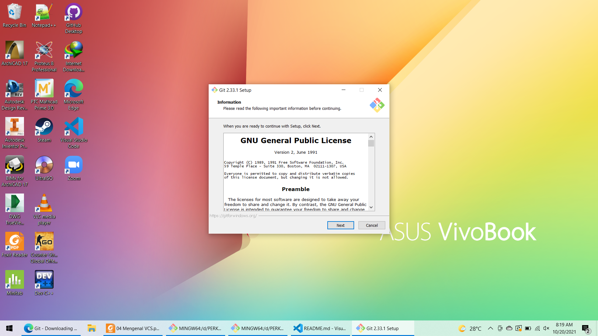

2.Pilih destinasi lokasi

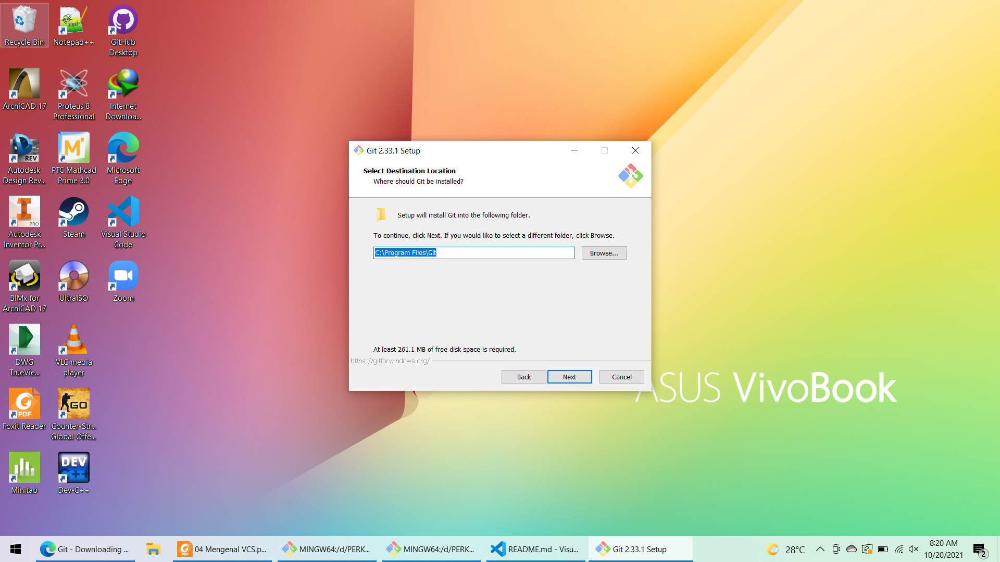

3.Pilih komponen

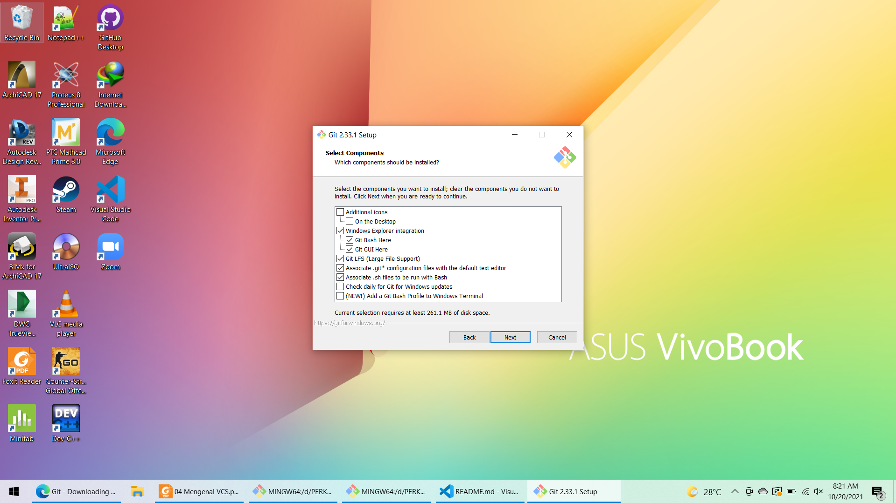

4.Pilih folder untuk mulai

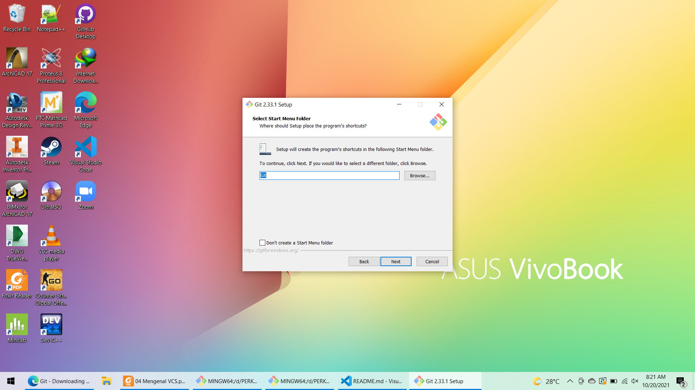

5.Pilih next

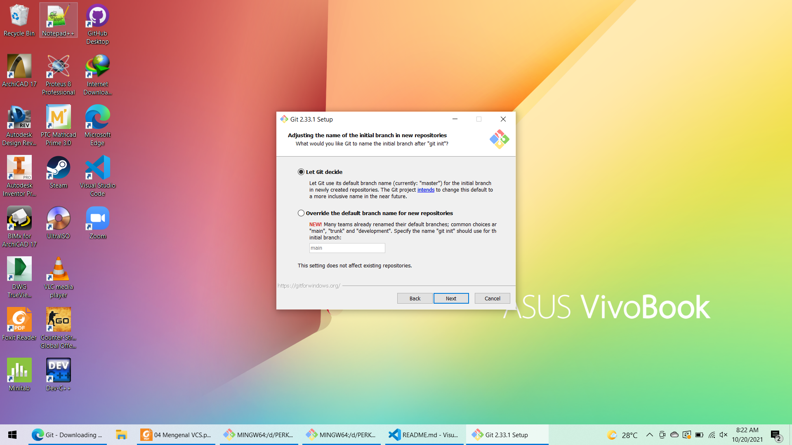

6.Pilih next

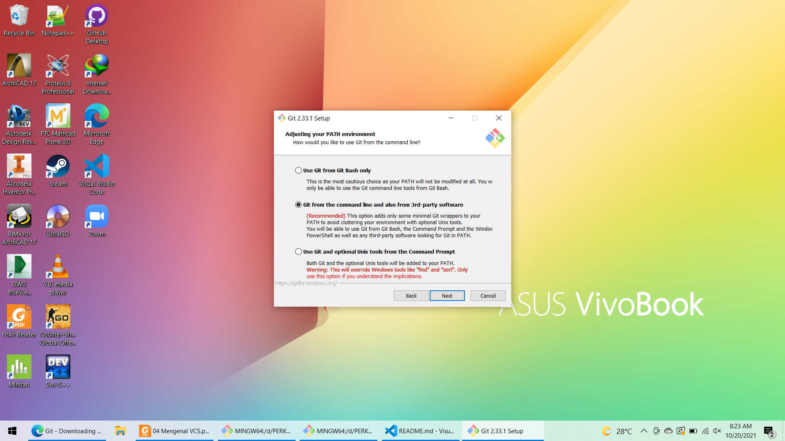

7.Proses instal

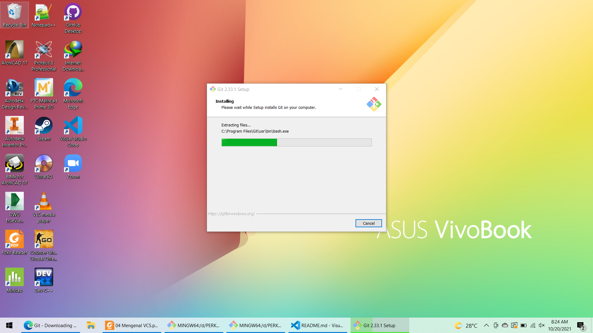

8.Selesai

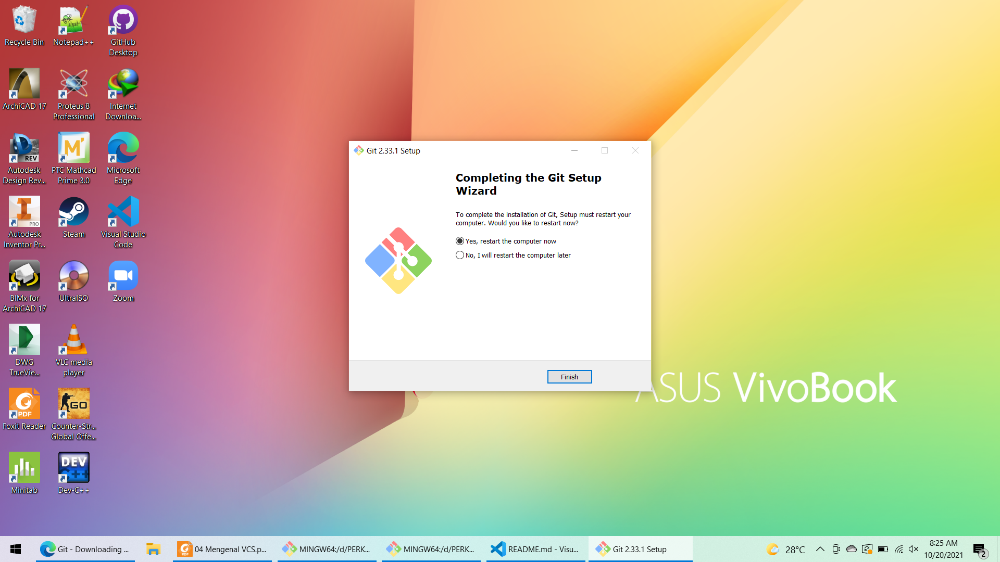

9.Untuk mencobanya, silahkan buka CMD kemudian ketik perintah git --version

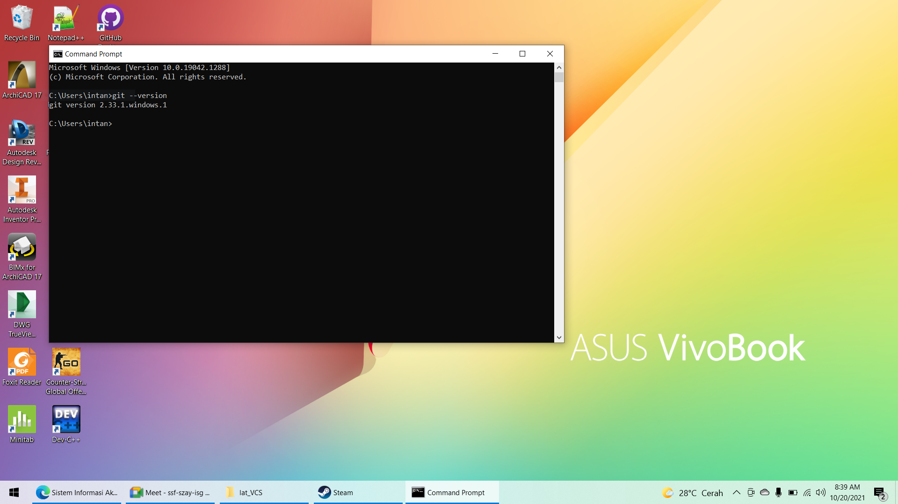

## Cara menggunakan git

1.Buka website github , jika belum terdaftar bisa buat akun dulu, jika sudah bisa langsung masuk

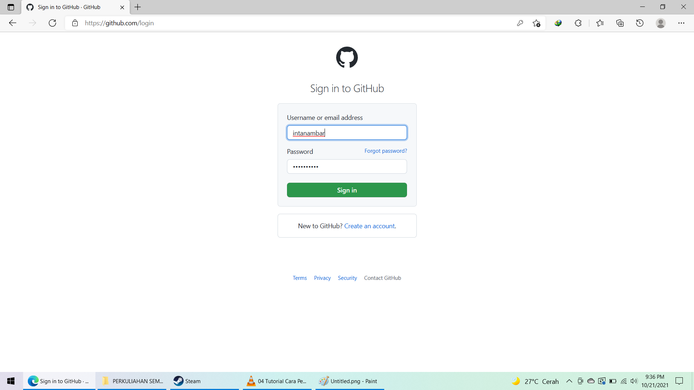

2.Buat Repositori baru, misal LatihanVCS1

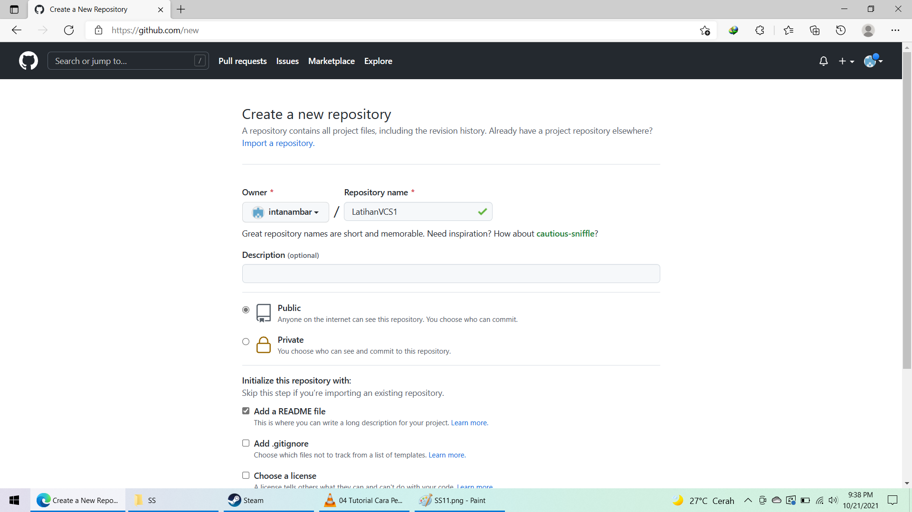

3.Buka git Bash, buat direktori baru dengan perintah cd

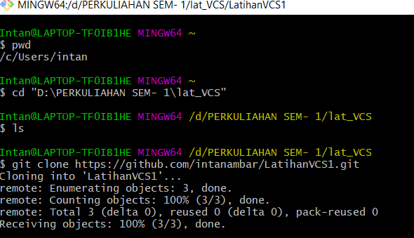

4.Untuk menambahkan file, gunakan perintah git add

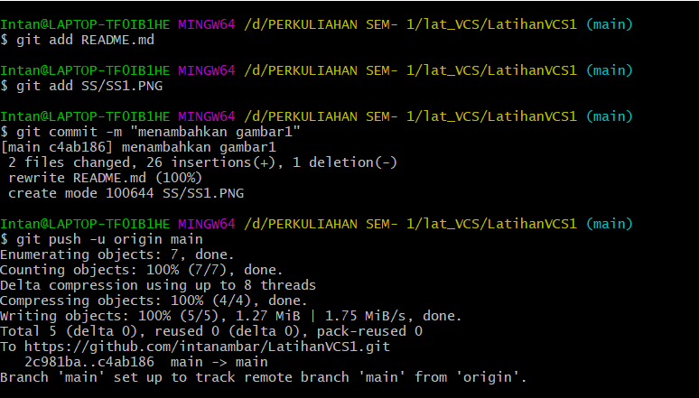

5.untuk menyimpan gunakan perintah git commit, dan
untuk mengirim perubahan menuju server Repositori gunakan perintah git push

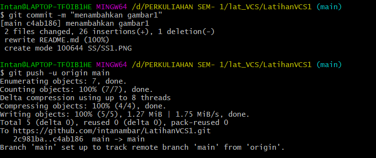 

Sekian dan terimakasih 
